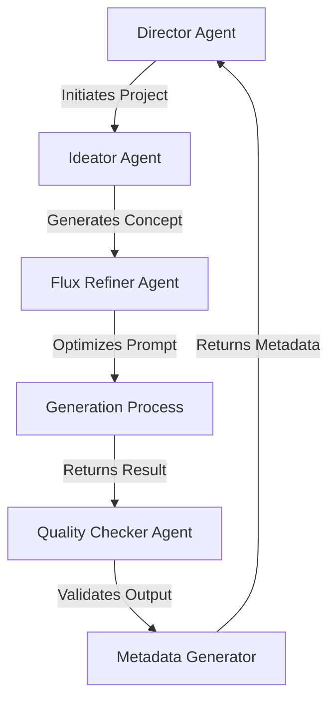

# Refactoring Guide

## 1. Configuration Standardization

### Current Issues
- Inconsistent inference steps (200 vs 28)
- Inconsistent dimensions (1024x1024 vs 768x768)
- Unclear which settings are defaults vs model-specific
- Scattered configuration across multiple files
- Unclear multi-agent system interactions and responsibilities

### Solution: Centralized Configuration

```typescript
// src/config/generationConfig.ts
interface ModelConfig {
  inferenceSteps: number;
  guidanceScale: number;
  dimensions: {
    width: number;
    height: number;
  };
}

interface GenerationConfig {
  default: ModelConfig;
  models: {
    [key: string]: ModelConfig;
  };
}

export const generationConfig: GenerationConfig = {
  default: {
    inferenceSteps: 200,
    guidanceScale: 35,
    dimensions: {
      width: 1024,
      height: 1024
    }
  },
  models: {
    "black-forest-labs/flux-1.1-pro": {
      inferenceSteps: 28,    // Optimized for FLUX
      guidanceScale: 3,      // FLUX-specific
      dimensions: {
        width: 768,          // FLUX optimal dimension
        height: 768          // FLUX optimal dimension
      }
    }
  }
};
```

## 2. Multi-Agent System Logging

### Agent Types and Responsibilities

```typescript
// src/types/agents.ts
interface Agent {
  id: string;
  role: AgentRole;
  status: AgentStatus;
}

enum AgentRole {
  DIRECTOR = 'director',
  IDEATOR = 'ideator',
  FLUX_REFINER = 'flux_refiner',
  QUALITY_CHECKER = 'quality_checker',
  METADATA_GENERATOR = 'metadata_generator'
}
```

### Agent Interaction Logging

```typescript
// src/utils/agentLogger.ts
export class AgentLogger {
  static logAgentAction(agent: Agent, action: string, details: string) {
    console.log(`\n┌─── ${agent.role.toUpperCase()} Agent (${agent.id}) ───┐`);
    console.log(`│ Action: ${action}`);
    console.log(`│ Details: ${details}`);
    console.log(`└${'─'.repeat(40)}┘`);
  }

  static logAgentInteraction(from: Agent, to: Agent, message: string) {
    console.log(`\n↓ ${from.role} → ${to.role}`);
    console.log(`└── ${message}`);
  }
}
```

## 3. Enhanced Terminal Output

### Current Output Issues
- Unclear agent interactions
- Mixed configuration and progress information
- Lack of visual hierarchy
- Difficult to track multi-agent workflow

### Proposed New Output Structure

```typescript
// src/utils/logger.ts
export class Logger {
  static printHeader(text: string) {
    console.log('\n' + '═'.repeat(50));
    console.log(`  ${text}`);
    console.log('═'.repeat(50) + '\n');
  }

  static printAgentSection(agent: Agent) {
    console.log(`\n┌─── ${agent.role.toUpperCase()} ───────────────┐`);
  }

  static printConfig(config: ModelConfig) {
    console.log(`│ Model Settings:`);
    console.log(`│ ├── Dimensions: ${config.dimensions.width}x${config.dimensions.height}`);
    console.log(`│ ├── Inference Steps: ${config.inferenceSteps}`);
    console.log(`│ └── Guidance Scale: ${config.guidanceScale}`);
  }

  static printAgentStatus(agent: Agent, status: string) {
    const timestamp = new Date().toISOString().split('T')[1].slice(0, -1);
    console.log(`│ [${timestamp}] ${agent.role}: ${status}`);
  }
}
```

### Example Multi-Agent Output

```
═══════════════════════════════════════════════════════
  IKIGAI Art Generation
═══════════════════════════════════════════════════════

┌─── DIRECTOR Agent (fb46c564) ───────────────┐
│ Action: Project Initialization
│ Details: Starting new art generation project
└────────────────────────────────────────────────┘

↓ director → ideator
└── Requesting initial concept generation

┌─── IDEATOR Agent (38db8025) ───────────────┐
│ Action: Concept Generation
│ Details: Creating initial artwork concept
└────────────────────────────────────────────────┘

┌─── FLUX_REFINER Agent (dd3503f4) ───────────┐
│ Action: Prompt Refinement
│ Details: Optimizing prompt for FLUX model
└────────────────────────────────────────────────┘

┌─── Generation Settings ───────────────────────┐
│ Model: black-forest-labs/flux-1.1-pro
│ Dimensions: 768x768
│ Inference Steps: 28
│ Guidance Scale: 3
└────────────────────────────────────────────────┘

┌─── Generation Progress ────────────────────────┐
│ ⏳ Generating prompt...
│ ✓ Prompt generated
│ ⏳ Creating artwork...
│ ✓ Artwork complete
└────────────────────────────────────────────────┘
```

## 4. Implementation Steps

1. **Configuration Refactor**
   - Create `src/config` directory
   - Add `generationConfig.ts`
   - Update all services to use centralized config

2. **Agent System Logging**
   - Create `src/types/agents.ts`
   - Add `agentLogger.ts`
   - Implement agent interaction tracking

3. **Logger Implementation**
   - Create `src/utils/logger.ts`
   - Replace console.log calls with structured logging
   - Add agent-specific logging methods

4. **Service Updates**
   ```typescript
   // src/services/artGeneration.ts
   import { Logger } from '../utils/logger';
   import { AgentLogger } from '../utils/agentLogger';
   
   export class ArtGenerationService {
     private director: Agent;
     private ideator: Agent;
     private fluxRefiner: Agent;
     
     async generateArt(prompt: string) {
       Logger.printHeader('IKIGAI Art Generation');
       
       // Director initiates the process
       AgentLogger.logAgentAction(
         this.director,
         'Project Initialization',
         'Starting new art generation project'
       );
       
       // Agent interactions
       AgentLogger.logAgentInteraction(
         this.director,
         this.ideator,
         'Requesting initial concept generation'
       );
       
       // Continue with generation process...
     }
   }
   ```

## 5. Benefits

- **Clear Agent Roles**: Each agent's responsibilities and actions are clearly visible
- **Traceable Interactions**: Agent communication flow is easy to follow
- **Consistent Configuration**: All settings in one place
- **Visual Hierarchy**: Better organized and more readable terminal output
- **Debugging**: Easier to identify where issues occur in the multi-agent system
- **Time Tracking**: Timestamps for agent actions

## 6. Future Improvements

- Add color coding for different agent types
- Implement detailed agent state tracking
- Add performance metrics for each agent
- Create agent interaction diagrams
- Add configuration validation
- Implement agent failure recovery logging

## 7. Migration Guide

1. Create new configuration and logger files
2. Update agent system to use new logging
3. Test each agent's logging implementation
4. Remove old console.log statements
5. Update tests to use new logging system
6. Document agent interaction patterns

## 8. Agent Interaction Flow



This diagram shows the typical flow of information between agents in the system. 