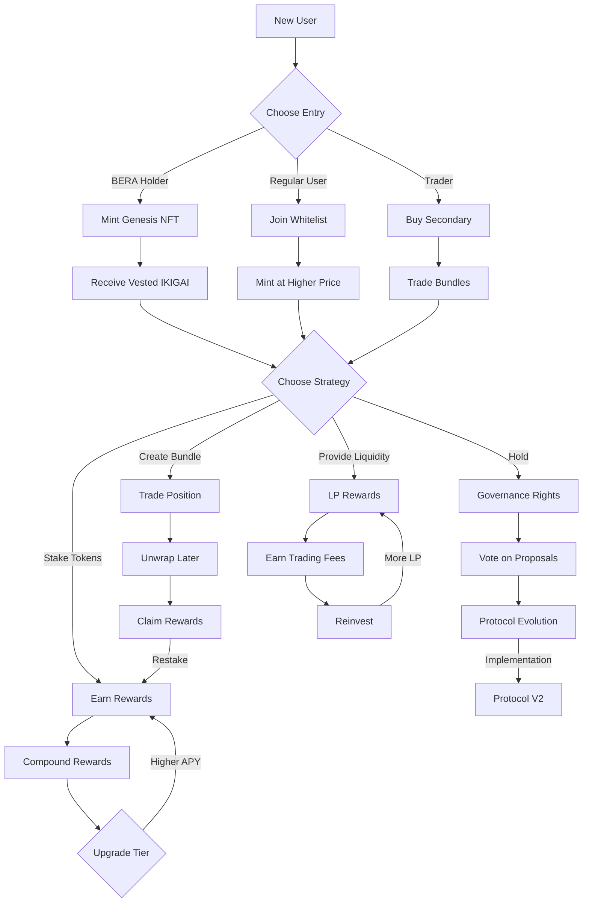
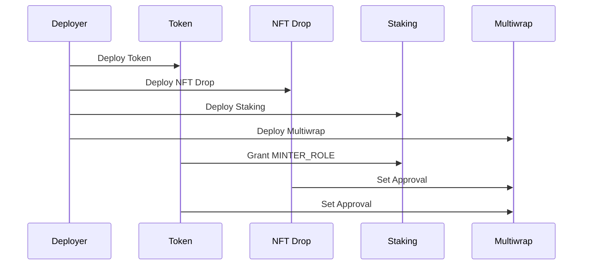

# IKIGAI Protocol Tokenomics

```
██╗██╗  ██╗██╗ ██████╗  █████╗ ██╗    ████████╗ ██████╗ ██╗  ██╗███████╗███╗   ██╗███████╗
██║██║ ██╔╝██║██╔════╝ ██╔══██╗██║    ╚══██╔══╝██╔═══██╗██║ ██╔╝██╔════╝████╗  ██║██╔════╝
██║█████╔╝ ██║██║  ███╗███████║██║       ██║   ██║   ██║█████╔╝ █████╗  ██╔██╗ ██║███████╗
██║██╔═██╗ ██║██║   ██║██╔══██║██║       ██║   ██║   ██║██╔═██╗ ██╔══╝  ██║╚██╗██║╚════██║
██║██║  ██╗██║╚██████╔╝██║  ██║██║       ██║   ╚██████╔╝██║  ██╗███████╗██║ ╚████║███████║
╚═╝╚═╝  ╚═╝╚═╝ ╚═════╝ ╚═╝  ╚═╝╚═╝       ╚═╝    ╚═════╝ ╚═╝  ╚═╝╚══════╝╚═╝  ╚═══╝╚══════╝
```

## Overview

IKIGAI is an NFT and DeFi protocol built on Berachain, leveraging thirdweb's battle-tested contracts for security and reliability. The protocol implements a sustainable tokenomics model through NFT-driven token distribution, staking mechanisms, and revenue sharing.

## Why This Model Works

Our tokenomics model is designed around three core principles:

```
┌─────────────────────┐      ┌─────────────────────┐      ┌─────────────────────┐
│   Value Creation    │      │   Value Capture     │      │   Value Accrual     │
│                     │      │                     │      │                     │
│ • Genesis NFTs      │─────▶│ • Trading Fees     │─────▶│ • Token Burns      │
│ • Staking Rewards   │      │ • NFT Royalties    │      │ • Staking Yields   │
│ • Bundle Trading    │      │ • Bundle Fees      │      │ • Treasury Growth   │
└─────────────────────┘      └─────────────────────┘      └─────────────────────┘
```

1. **Fair Launch Distribution**
   - Zero pre-mine ensures fair distribution
   - NFT-driven token generation prevents dumping
   - Vesting mechanics protect early price action

2. **Sustainable Revenue Model**
   - Multiple fee streams (trading, NFTs, bundles)
   - Revenue split optimized for growth
   - Automated buyback and burn mechanism

3. **Value Lock Mechanisms**
   - Tiered staking encourages long-term holding
   - NFT staking provides additional utility
   - Bundle system enables efficient trading

## User Flows



## Detailed Tokenomics Breakdown

### 1. Token Distribution Model

```
┌─────────────────────────────────────────────┐
│              Token Distribution             │
├─────────────────┬───────────────┬──────────┤
│    Activity     │ % of Supply   │ Vesting  │
├─────────────────┼───────────────┼──────────┤
│ Genesis NFTs    │     40%       │ 90 days  │
│ Staking Rewards │     35%       │ Instant  │
│ Community/DAO   │     15%       │ 180 days │
│ Treasury        │     10%       │ 365 days │
└─────────────────┴───────────────┴──────────┘
```

### 2. Revenue Allocation

```
┌──────────────────────────────────────────┐
│           Revenue Distribution           │
├────────────────┬─────────────┬──────────┤
│    Source      │ Allocation  │   Use    │
├────────────────┼─────────────┼──────────┤
│ Trading Fees   │    4.3%     │ Split    │
│ NFT Sales      │    35%      │ Protocol │
│ Bundle Fees    │    2.5%     │ Treasury │
└────────────────┴─────────────┴──────────┘
```

### 3. Staking Mechanics

```
┌───────────────────────────────────────────────┐
│              Staking Benefits                 │
├──────────┬──────────┬───────────┬────────────┤
│   Tier   │   Lock   │  Min Stake│ Multiplier │
├──────────┼──────────┼───────────┼────────────┤
│  Base    │  7 days  │   1,000   │    1x     │
│  Silver  │ 14 days  │   5,000   │   1.25x   │
│  Gold    │ 21 days  │  10,000   │   1.5x    │
│ Diamond  │ 28 days  │  25,000   │    2x     │
└──────────┴──────────┴───────────┴────────────┘
```

## Implementation Strategy

### Phase 1: Genesis Launch
1. Deploy NFT Drop contract
2. Configure whitelist and claim conditions
3. Enable BERA holder benefits
4. Start Genesis minting

### Phase 2: Token Activation
1. Deploy Token contract
2. Set up vesting schedules
3. Configure reward distribution
4. Enable staking contracts

### Phase 3: Ecosystem Growth
1. Deploy Bundle system
2. Activate revenue sharing
3. Launch governance
4. Enable community features

## Core Components

### 1. Token System (thirdweb Token)

- **Token Details**
  - Standard: ERC20
  - Name: IKIGAI
  - Symbol: IKIGAI
  - Maximum Supply: 1,000,000,000 (1 billion)
  - Initial Supply: 0 (fair launch)
  - Decimals: 18

### 2. NFT Collections

#### Genesis Collection (thirdweb NFT Drop)
- Mint with BERA tokens
- Whitelist support for early access
- Priority access for BeraChain NFT holders
- Claim conditions for different phases

#### Post-Genesis Collections
- Mint with IKIGAI tokens
- Revenue split (thirdweb Split):
  - 35% to Protocol (Buyback & burn)
  - 50% to Creator rewards
  - 15% to Treasury

### 3. Staking System

#### Token Staking (thirdweb Stake ERC20)
- **Lock Periods & Tiers**
  - Base: 7 days, 1,000 IKIGAI minimum, 1x rewards
  - Silver: 14 days, 5,000 IKIGAI minimum, 1.25x rewards
  - Gold: 21 days, 10,000 IKIGAI minimum, 1.5x rewards
  - Diamond: 28 days, 25,000 IKIGAI minimum, 2x rewards

#### NFT Staking (thirdweb Stake ERC721)
- Stake Genesis NFTs for additional rewards
- Flexible lock durations
- Compound rewards option

### 4. Bundle System (thirdweb Multiwrap)

#### Genesis Bundles
- Wrap BERA + IKIGAI rewards + Genesis NFT
- Trade entire position as one unit
- Unwrap after vesting completion

#### Collection Bundles
- Combine multiple NFTs into one token
- Create curated sets
- Enable bulk trading

### 5. Revenue Distribution (thirdweb Split)

#### Trading Fees (4.3% total)
- 2.0% Protocol Owned Liquidity
- 1.3% Staking Rewards
- 1.0% Treasury Operations

### 6. Claim Systems

#### Token Claims (thirdweb ERC20 Claimable)
- Vested rewards from Genesis NFTs
- Staking reward distributions
- Community airdrops

#### NFT Claims (thirdweb ERC721 Claimable)
- Whitelist minting phases
- Community rewards
- Event participation rewards

## Smart Contract Architecture

### Core Contracts (All thirdweb)
1. Token Contract (ERC20)
2. NFT Drop Contract (ERC721)
3. Stake ERC20 Contract
4. Stake ERC721 Contract
5. Split Contract
6. Multiwrap Contract
7. Airdrop Contracts (ERC20 & ERC721)

## Getting Started

### Prerequisites
- Node.js v18.6+
- TypeScript 5.0.4+ (for TypeScript users)
- React 18.0.0+ (for React users)
- Berachain wallet

### Installation & Setup

```bash
# Install thirdweb V5
npm install thirdweb

# Generate Client ID (required)
npx thirdweb generate-client-id

# Create new project (optional)
npx thirdweb create app
```

### Basic Configuration
```typescript
// Initialize thirdweb client
import { createThirdwebClient } from "thirdweb";

const client = createThirdwebClient({
  clientId: "your-client-id",
  chainId: 80094 // Berachain
});

// Contract initialization examples
const nftDrop = getContract({
  client,
  address: "your-nft-drop-address",
  abi: nftDropAbi,
});

const token = getContract({
  client,
  address: "your-token-address",
  abi: tokenAbi,
});
```

## Documentation & Contract References

### Core Contracts
1. **Token (ERC20)**
   - [Contract Documentation](https://portal.thirdweb.com/contracts/explore/pre-built-contracts/token)
   - Features: Mintable, burnable, permit support
   - Used for: IKIGAI token implementation

2. **NFT Drop (ERC721)**
   - [Contract Documentation](https://portal.thirdweb.com/contracts/explore/pre-built-contracts/nft-drop)
   - Features: Delayed reveal, whitelist, claim phases
   - Used for: Genesis NFT collection

3. **Stake ERC20**
   - [Contract Documentation](https://portal.thirdweb.com/contracts/explore/pre-built-contracts/stake-erc20)
   - Features: Token staking, reward distribution
   - Used for: IKIGAI token staking system

4. **Stake ERC721**
   - [Contract Documentation](https://portal.thirdweb.com/contracts/explore/pre-built-contracts/stake-erc721)
   - Features: NFT staking, reward configuration
   - Used for: Genesis NFT staking

5. **Split**
   - [Contract Documentation](https://portal.thirdweb.com/contracts/explore/pre-built-contracts/split)
   - Features: Revenue distribution, automatic splits
   - Used for: Protocol fee distribution

6. **Multiwrap**
   - [Contract Documentation](https://portal.thirdweb.com/contracts/explore/pre-built-contracts/multiwrap)
   - Features: Bundle ERC20/721/1155 tokens
   - Used for: Genesis bundles and collection sets

7. **Airdrop ERC20/721 (Claimable)**
   - [ERC20 Documentation](https://portal.thirdweb.com/contracts/explore/pre-built-contracts/airdrop-erc20-claimable)
   - [ERC721 Documentation](https://portal.thirdweb.com/contracts/explore/pre-built-contracts/airdrop-erc721-claimable)
   - Features: Merkle tree claims, allowlist
   - Used for: Community rewards and airdrops

### Additional Resources
- [thirdweb V5 Documentation](https://portal.thirdweb.com/typescript/v5)
- [React SDK Documentation](https://portal.thirdweb.com/react/v5)
- [Contract Deployment Guide](https://portal.thirdweb.com/deploy)
- [IKIGAI Documentation](https://docs.ikigai.xyz)

## License

This project is licensed under the MIT License - see the [LICENSE](LICENSE) file for details.

## Security & Risk Management

### Smart Contract Security
```
┌──────────────────────────────────────────────────┐
│               Security Features                  │
├────────────────────┬─────────────────────────────┤
│ Feature           │ Protection                   │
├────────────────────┼─────────────────────────────┤
│ Access Control    │ Role-based (RBAC)           │
│ Upgrades         │ Time-locked + DAO vote       │
│ Emergency        │ Circuit breaker pattern      │
│ Reentrancy       │ Check-Effects-Interactions   │
│ Oracle           │ Chainlink price feeds        │
└────────────────────┴─────────────────────────────┘
```

### Risk Mitigation
1. **Vesting & Lockups**
   - Gradual token release prevents dumps
   - Time-locked treasury actions
   - Staking cooldown periods

2. **Value Protection**
   - Maximum mint limits
   - Dynamic pricing models
   - Slippage protection

3. **Governance Security**
   - Timelocks on proposals
   - Quorum requirements
   - Vote delegation support

## Technical Integration Guide

### 1. Contract Deployment Flow


### 2. Example Integration Code

```typescript
// 1. Initialize Core Contracts
const contracts = {
  token: getContract({
    client,
    address: TOKEN_ADDRESS,
    abi: tokenAbi,
  }),
  nftDrop: getContract({
    client,
    address: NFT_DROP_ADDRESS,
    abi: nftDropAbi,
  }),
  staking: getContract({
    client,
    address: STAKING_ADDRESS,
    abi: stakingAbi,
  })
};

// 2. Setup Claim Conditions
const claimConditions = [
  {
    startTime: new Date(), // Phase 1
    maxQuantity: 1000,
    price: parseEther("0.1"),
    snapshot: whitelist,
  },
  {
    startTime: new Date(Date.now() + 86400000), // Phase 2
    maxQuantity: 2000,
    price: parseEther("0.15"),
  }
];

// 3. Configure Staking Tiers
const stakingTiers = [
  {
    minimumStake: parseEther("1000"),
    lockupTime: 7 * 86400, // 7 days
    rewardMultiplier: 100, // 1x
  },
  {
    minimumStake: parseEther("5000"),
    lockupTime: 14 * 86400, // 14 days
    rewardMultiplier: 125, // 1.25x
  }
];

// 4. Revenue Sharing Setup
const revenueShares = [
  { recipient: PROTOCOL_ADDRESS, share: 200 }, // 2%
  { recipient: STAKING_ADDRESS, share: 130 },  // 1.3%
  { recipient: TREASURY_ADDRESS, share: 100 }  // 1%
];
```

### 3. Frontend Integration

```typescript
// React Hook Example
import { useContract, useNFTDrop, useToken, useStaking } from "@thirdweb-dev/react";

function IkigaiApp() {
  // Contract Hooks
  const { contract: nftDrop } = useNFTDrop(NFT_DROP_ADDRESS);
  const { contract: token } = useToken(TOKEN_ADDRESS);
  const { contract: staking } = useStaking(STAKING_ADDRESS);

  // Mint NFT Function
  async function mintNFT() {
    try {
      const tx = await nftDrop?.claim(1);
      console.log("NFT Minted:", tx);
    } catch (err) {
      console.error("Failed to mint:", err);
    }
  }

  // Stake Tokens Function
  async function stakeTokens(amount: string) {
    try {
      const tx = await staking?.stake(parseEther(amount));
      console.log("Tokens Staked:", tx);
    } catch (err) {
      console.error("Failed to stake:", err);
    }
  }

  return (
    // Your UI components
  );
}
```

## User Flow Diagram (Enhanced)


